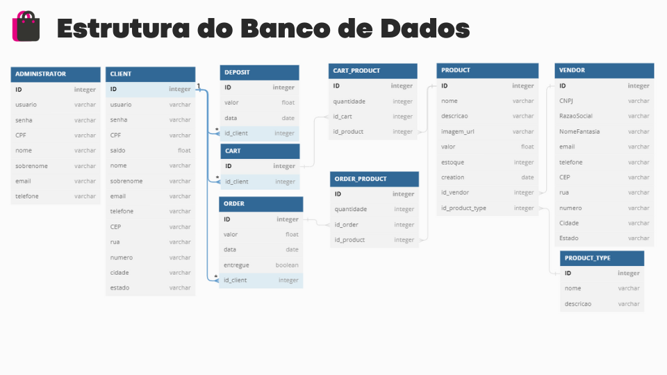
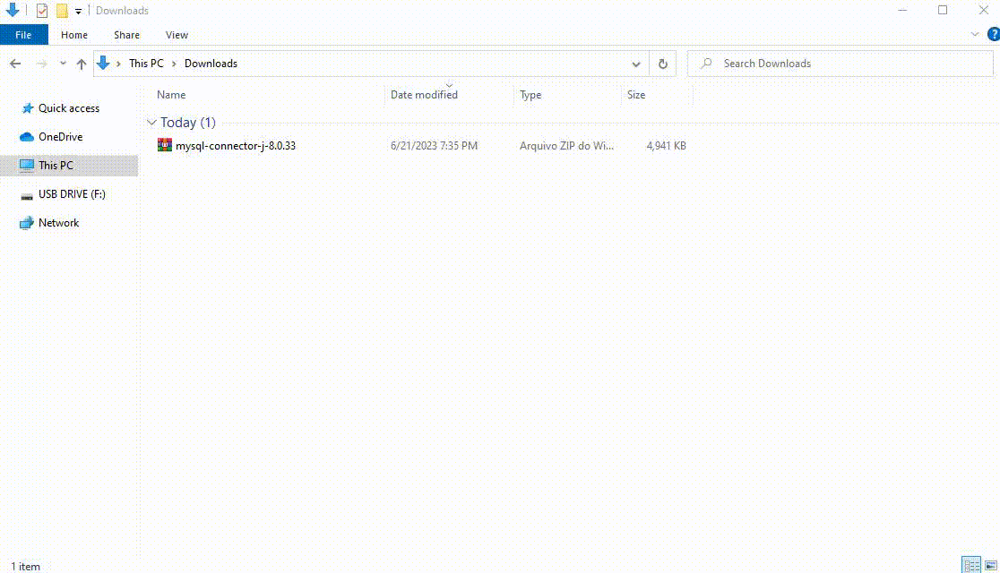
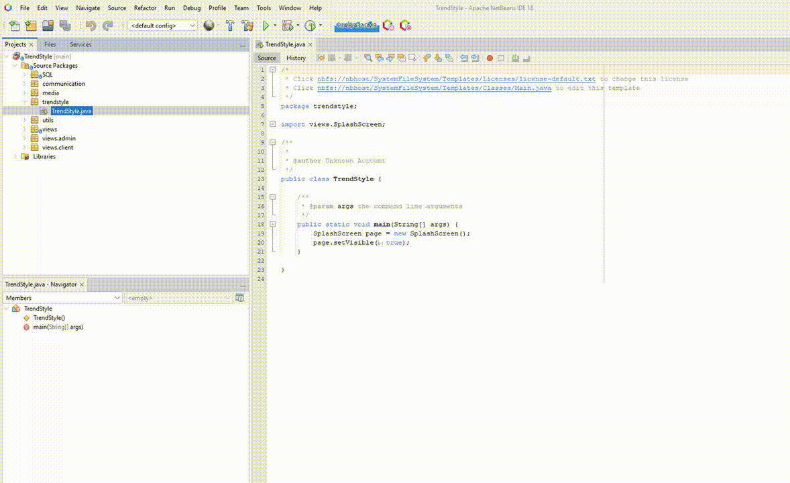

# 🎓 TrendStyle Shop

## 📘 Sobre o Projeto

O TrendStyle é um projeto desenvolvido em Java, usando um banco de dados MySQL, que simula uma loja virtual no âmbito do comércio eletrônico. Ele visa oferecer uma experiência otimizada de gestão e compra com atualizações em tempo real.

A interface administrativa do protótipo permite gerenciar vários aspectos operacionais, incluindo fornecedores, categorias de produtos e itens à venda. Os administradores também podem gerenciar outros usuários com privilégios de gerenciamento. Além disso, o sistema de processamento de pedidos permite atualizar o status dos pedidos e fornecer informações simuladas de entrega.

A interface do cliente foi projetada para proporcionar uma experiência de compra intuitiva e fácil. Os usuários podem visualizar todos os produtos, adicioná-los ao carrinho e fazer pagamentos fictícios através de depósitos registrados no sistema. Eles também podem acompanhar o status de pedidos simulados e atualizar suas informações cadastrais.


## 🔧 Construção do Sistema

O sistema TrendStyle foi construído utilizando Java e a IDE NetBeans. Escolhemos estas tecnologias por sua capacidade de lidar com projetos de grande escala e permitir um desenvolvimento eficiente. Usamos a ferramenta Canva para o design das interfaces do usuário, proporcionando uma experiência intuitiva e agradável.

O projeto é dividido em diversas telas, criando painéis dedicados para administradores e clientes. Esses elementos são integrados diretamente a um banco de dados otimizado para maximizar o desempenho e facilitar a implementação no projeto Java.

Desenvolvemos várias Procedures e Views no banco de dados para melhorar a manipulação de dados e a eficiência geral do sistema. Essas ferramentas têm restrições e ajustes personalizados para cada ação, garantindo que o sistema funcione com a maior eficiência possível.




## 💻 Tecnologias Utilizadas

- ☕️ Java & NetBeans
- 📊 Mermaid.js & dbdiagram.io
- 🐬 MySQL & MySQL Workbench
- 🎨 Canva

## 📋 Requisitos para Utilizar o Sistema

Para executar o NotFound Server localmente, você precisa ter os seguintes softwares instalados:

- ☕️ Java (JDK 17)
- 🔶 NetBeans
- 🐬 MySQL Server (8.0.33)

Também é necessário que o usuário precisa ter familiaridade com a IDE NetBeans, domínio básico de Java e compreender como utilizar e configurar um banco de dados MySQL.

## 🚀 Como Usar

1. Clone o repositório com o seguinte comando:

    ```sh
    git clone https://github.com/FacensProjects/Facens-TrendStyle.git
    ```

2. Instale e configure seu servidor [MySQL Community Server 8.0.33](https://dev.mysql.com/downloads/mysql).

3. Em seguida, instale o [Connector/J 8.0.33](https://dev.mysql.com/downloads/connector/j/):

    
   
4. Descompacte o Connector e remova o arquivo compactado:

    

5. No NetBeans, abra o projeto e, com o botão direito, selecione properties -> libraries -> adicionar classpath -> (selecione o arquivo jar do connector) e confirme:

    

6. Para criar a estrutura de banco de dados, execute os arquivos SQL localizados na pasta [TrendStyle/src/SQL](TrendStyle/src/SQL) na seguinte ordem:

    ```sh
    DATABASE.sql (Obrigatório)
    SCHEMA.sql   (Obrigatório)
    POPULATE.sql (Opcional)
    ```
    * Use o [MySQL Workbench](https://dev.mysql.com/downloads/workbench/) para facilitar a execução dos arquivos SQL.
    
7. Altere o arquivo [TrendStyle\src\communication\MySQL.java](TrendStyle/src/communication/MySQL.java) com as informações do seu servidor:

    ```java
    private String servidor = "localhost:3306";
    private String nomeDoBanco = "TrendStyle";
    private String usuario = "root"; // Coloque aqui o seu usuário
    private String senha = "root";   // Coloque aqui a sua senha
    ```
8. Clique com o botão direito no projeto e selecione "Clean and Build" para prepará-lo para a execução.

9. Agora que tudo está configurado, basta executar o software e explorar suas funcionalidades!

    
   
## 👥 Desenvolvedores

- [WhitePoodleMoth](https://github.com/WhitePoodleMoth)
- [AnnelisePD](https://github.com/annelisepd)

## 📄 Licença

O TrendStyle Shop é licenciado sob a Licença MIT. Consulte o arquivo [LICENSE](LICENSE) para mais detalhes.
